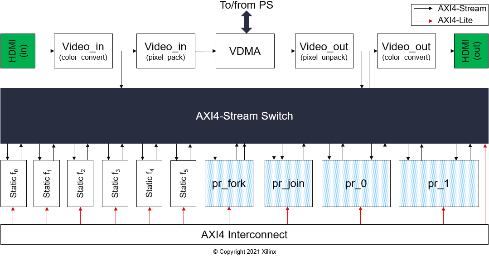

# Composable Pipeline

The Composable pipeline is an overlay with a novel and clever architecture that allow us to adapt how the data flows between a series of IP cores.

The key characteristic of a composable overlay is an AXI4-Stream Switch, which plays the same role as an old [telephone switchboard](https://en.wikipedia.org/wiki/Telephone_switchboard). The AXI4-Stream Switch provides the runtime routing of how data flow from one IP core to another.

On top of that, the composable overlay includes Dynamic Function eXchange [DFX](https://www.xilinx.com/products/design-tools/vivado/implementation/dynamic-function-exchange.html) regions that brings new functionality to the design at runtime.

The combination of these two technologies plus a pythonic API, built on top of [pynq](http://www.pynq.io/), provide an unprecedented flexibility.

The composable overlay architecture of a composable video overlay for the PYNQ-Z2 is shown in the image below



## Clone this repository

```sh
git clone https://github.com/Xilinx/PYNQ_Composable_Pipeline.git --recursive
```

Note that this project depends on the [Vitis Accelerated Libraries](https://github.com/Xilinx/Vitis_Libraries) and [PYNQ](https://github.com/Xilinx/PYNQ)

## Install composable pipeline on your board

```
sudo pip3 install git+https://github.com/Xilinx/PYNQ_Composable_Pipeline.git
pynq-get-notebooks composable-pipeline -p $PYNQ_JUPYTER_NOTEBOOKS
```

The notebooks will be delivered into the folder `/home/xilinx/jupyter_notebooks`

Supported boards [PYNQ-Z2](https://www.tul.com.tw/ProductsPYNQ-Z2.html) and [PYNQ-ZU](https://www.tul.com.tw/ProductsPYNQ-ZU.html)

## Rebuild composable pipeline from scratch

To rebuild the composable pipeline you need Vitis 2020.2 installed. Navigate to one of the supported boards folder and run make, only steps for Linux are provided.

* [PYNQ-Z2](boards/Pynq-Z2/README.md)
* [PYNQ-ZU](boards/Pynq-ZU/README.md)

## Licenses

Copyright (C) 2021 Xilinx, Inc

[SPDX-License-Identifier: BSD-3-Clause](LICENSE.md)

[Third-party license](THIRD_PARTY_LIC)

### Binary Files License

Pre-compiled binary files are not provided under an OSI-approved open source license, because Xilinx is incapable of providing 100% corresponding sources.

Binary files are provided under the following [license](boards/Pynq-Z2/LICENSE)

------------------------------------------------------
<p align="center">Copyright&copy; 2021 Xilinx</p>