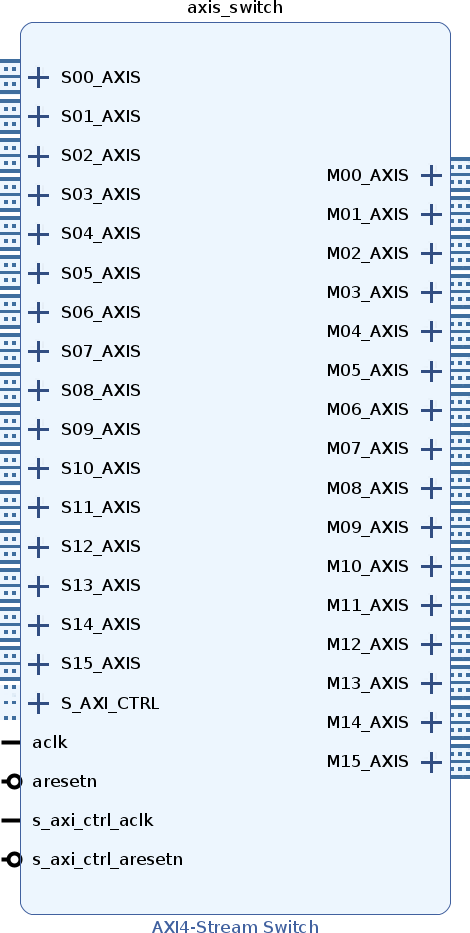
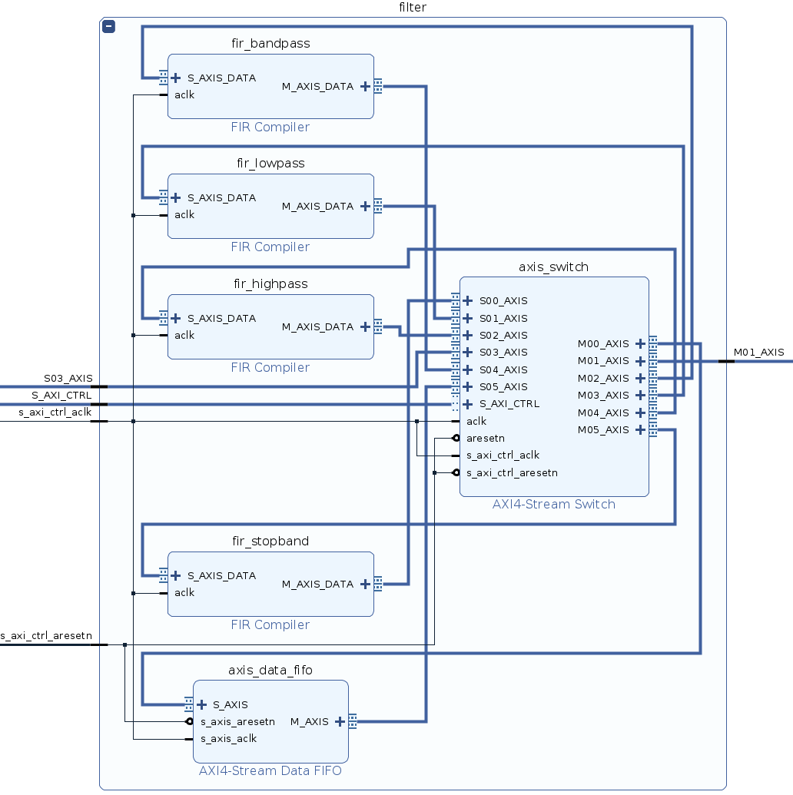
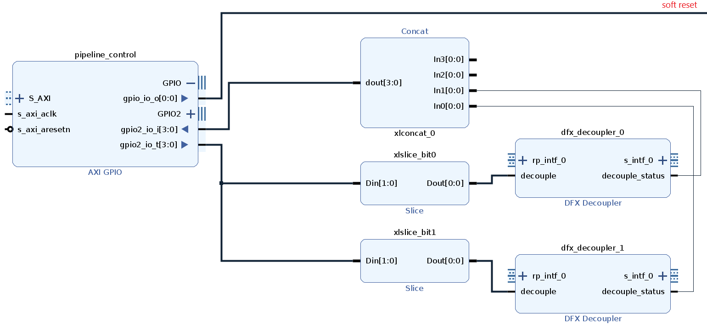
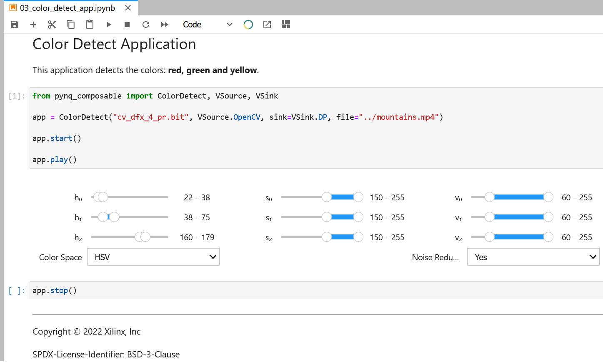

..
  Copyright (C) 2022 Xilinx, Inc
  
  SPDX-License-Identifier: BSD-3-Clause

.. composable-methodology:

******************************
Composable Overlay Methodology
******************************

There are two key characteristics of a composable overlay 

  1. Uses at least one AXI4-Stream Switch -- configured to use control register routing.

  2. Wraps the composable logic into a hierarchy.

An additional characteristic of a composable overlay is 3) Dynamic Function
eXchange (DFX)

AXI4-Stream Switch
==================

The `AXI4-Stream Switch <https://www.xilinx.com/products/intellectual-property/axi4-stream_interconnect.html#documentation>`_
is a standard IP from the Vivado catalog, for more information refer to PG 085.
The AXI4-Stream Switch provides configurable routing between managers and
subordinates. It supports up to 16 managers and 16 subordinates and two routing
options (we are only interested in the *control register routing*)

With the control register routing enabled, an AXI4-Lite interface is used to
configure the routing table. There is one register for each of the managers
interfaces to control each of the selectors. This routing mode requires that
there is precisely only one path between manager and subordinate. When
attempting to map the same subordinate interface to multiple manager interfaces,
only the lowest manager interface is able to access the subordinate interface.

The Python driver to manage the AXI4-Stream Switch is
:class:`pynq_composable.switch.StreamSwitch`. The driver is assigned automatically. This is the
lowest level API to compose your design. It is unlikely that you will operate
at this level of abstraction. 

The image below shows and AXI4-Stream Switch configured with 16 managers and 16
subordinates.

Hierarchy
=========

In Vivado IP Integrator, your can create a hierarchical block in a diagram
to group a set of IP. Many IP in the Vivado catalog are implemented as
hierarchical IP or also called subsystems.

In the case of the composable overlays, all the logic associated to the
composable portion must be inside of a hierarchy. 

The benefit of having the composable logic in a hierarchy is that `pynq`
assigns the `DefaultHierarchy <https://pynq.readthedocs.io/en/latest/pynq_package/pynq.overlay.html#pynq.overlay.DefaultHierarchy>`_
automatically. The :class:`pynq_composable.composable.Composable` inherits from
`DefaultHierarchy` and it is assigned automatically if an AXI4-Stream Switch
is detected within the hierarchy.

Refer to the PYNQ documentation for more information about
`Creating Hierarchy Drivers <https://pynq.readthedocs.io/en/latest/overlay_design_methodology/python_overlay_api.html#creating-hierarchy-drivers>`_.

The image below shows a composable hierarchy.

Dynamic Function eXchange (DFX)
===============================

`DFX <https://www.xilinx.com/content/xilinx/en/products/design-tools/vivado/high-level-design.html#dfx>`_
is the ability to dynamically modify blocks of logic by downloading
partial bit files while the remaining logic continues to operate without
interruption. DFX is optional in a composable overlay, and if used,
it unleashes the full potential of the FPGA fabric. 

DFX is well supported in the composable overlay APIs. However,
DFX is an advanced topic that should be explored by experienced hardware
designers.

If you decide to use DFX, you should include a `DFX Decoupler IP <https://www.xilinx.com/products/intellectual-property/dfx-decoupler.html>`_
for each partial Reconfigurable Partition (RP). This IP provides logical isolation
capabilities for DFX designs to prevent from unpredictable activity while
dynamic reconfiguration is occurring. The DFX Decoupler core can be customized
for the number of interfaces, type of interfaces, decoupling functionality,
status and control. AXI-based interfaces are natively supported.

The :class:`pynq_composable.composable.Composable` driver can control the
DFX Decoupler IP via an `AXI GPIO <https://www.xilinx.com/products/intellectual-property/axi_gpio.html>`_.
This AXI GPIO must be included in the same hierarchy as the AXI4-Stream Switch.

The output interface GPIO is dedicated to soft reset (active high). The
interface GPIO2 is dedicated to the DFX Decoupler IP. 
You will configure the GPIO width of GPIO2 with the double of DFX Decoupler IP
present in your design. 

  1. Connect the AXI GPIO ``gpio2_io_o`` pin to an Slice IP (configure it
  properly), the output of the Slice IP will be connected to the ``decouple``
  pin of the DFX Decoupler IP.

  2. Repeat step 1 for the rest of DFX Decoupler IP. Do **not reuse** the same
  bit index for different DFX Decoupler IP.

  3. Connect all the *decouple_status* pin of the DFX Decoupler IP to a Concat
  IP. Avoid reusing the bit index used for the status pin.

  4. Connect the Concat ``dout`` pin to the AXI GPIO ``gpio2_io_i`` pin.

You can see an example of these connection in the image below.

The :attr:`pynq_composable.composable.Composable.dfx_dict` will automatically
populate this information from the design. When you download a partial
bitstream you will use the :meth:`pynq_composable.composable.Composable.load`.
This method will decouple the Reconfigurable Partition before downloading the
partial bitstream.

Application Programming Interface (API)
=======================================

There are two different APIs to interact with a composable overlay. Both of
these have been already discussed.

StreamSwitch Driver
~~~~~~~~~~~~~~~~~~~

The :class:`pynq_composable.switch.StreamSwitch` driver, this is the lowest
level API and it requires intimate knowledge of the design and how the manager
and subordinate interfaces are connected to the AXI4-Stream Switch

Composable Driver
~~~~~~~~~~~~~~~~~

The :class:`pynq_composable.composable.Composable` driver provides an
out-of-the-box experience with any composable overlay. The hardware will be
automatically discovered, this process takes a few seconds the first time, and
expose to the users. The hardware information is presented in the 
:attr:`pynq_composable.composable.Composable.c_dict`.

To compose a pipeline, use the :meth:`pynq_composable.composable.Composable.compose`
method. You can analyzed the composed pipeline with the :attr:`pynq_composable.composable.Composable.graph`.
You can remove, replace, insert and tap at any stage of the pipeline.

Pipeline App
~~~~~~~~~~~~

There is a third API, which is much higher level and integrates widgets and
pre-configured pipelines. The implementation of this API will be tightly-coupled
to the domain of the composable overlay. However, we suggest three basic
methods for this API: ``.start()``, ``.play()`` and ``.stop()``. These methods,
in combination with widgets or a dashboard should convey all the application
functionality.

One such example of this high level API is the :class:`pynq_composable.apps.PipelineApp`,
this is the parent class of all the applications supported by the Composable Video Pipeline.

The image below shows the widgets used to control the ColorDetect application.

