(composable-overlay-tutorial)=

# Create Composable Overlays (hw)

This tutorial will show how to create a composable overlay from scratch using
standard IP from the Vivado IP catalog. In particular, we will use 

## Create a Vivado project

Creating a new composable overlay starts like any other design hardware design
for PYNQ, if you are not familiar with this process check out 
[Tutorial: Creating a hardware design for PYNQ](https://discuss.pynq.io/t/tutorial-creating-a-hardware-design-for-pynq/145)

In this case we will target the [Kria KV260 Vision AI Starter Kit](https://www.xilinx.com/products/som/kria/kv260-vision-starter-kit.html),
note that we will use Vivado 2022.1.

1. Create a New Project
1. Click *Next >* in the first window
1. Set *Project name:* to `composable_filter` (a); select the 
*Project location:* that is more appropriate for you (b); click *Next >* (c)
1. Set the Project Type to *RTL Project* (d); check
*Do not specify sources at this time* (e); click *Next >* (f)
1. Set the Default Part, click on Boards (g); then select Kria KV260 Vision AI
Started Kit (h); click *Next >* (i)
1. Click *Finish* (j) on the Project Summary window

The animated GIF below shows these steps

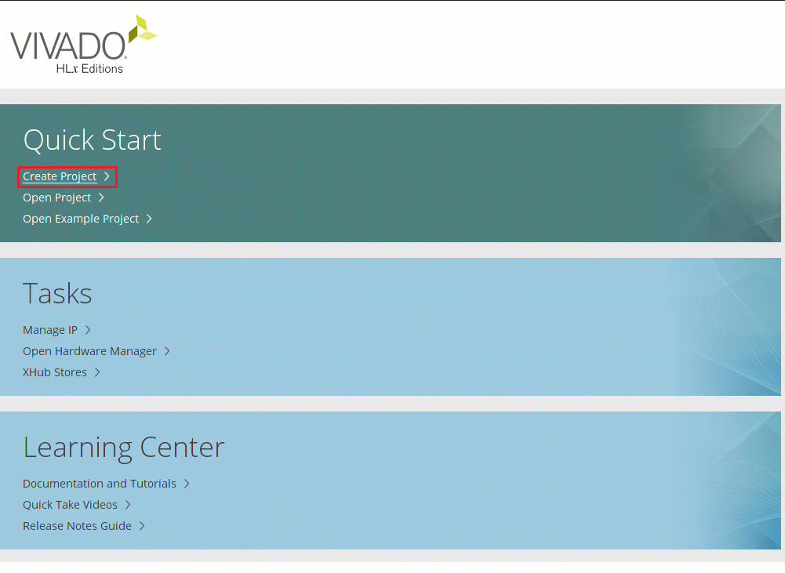

## Create a Block Design

1. Under IP INTEGRATOR, click on create Block Design
1. Set *system* as design name

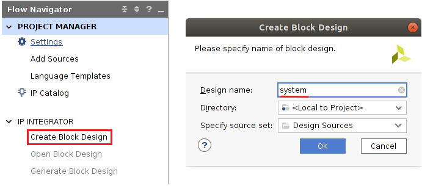

## Add Processing System

As we will be moving data from the ARM processor to the Programmable Logic add
the Processing System (PS).

1. In the *Diagram* tab (a) click the **+** symbol to add an IP (b)
1. Search for *zynq* and select *Zynq Ultrascale+ MPSoC* (c)
1. Run Block Automation (d) to configure the PS block with the default
settings for the Kria KV260 Vision AI Started Kit
1. Check *All Automation (1 out of 1 selected)* (e) and then click *OK* (f),
the block is now configured (g)

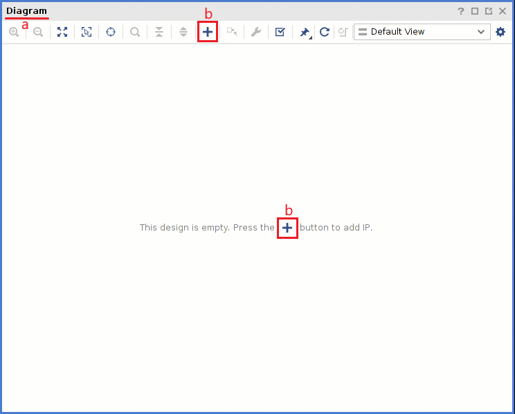

### Configure the PS

1. Double click on the Processing System block, or right click on it and
select `Customize Block...`

   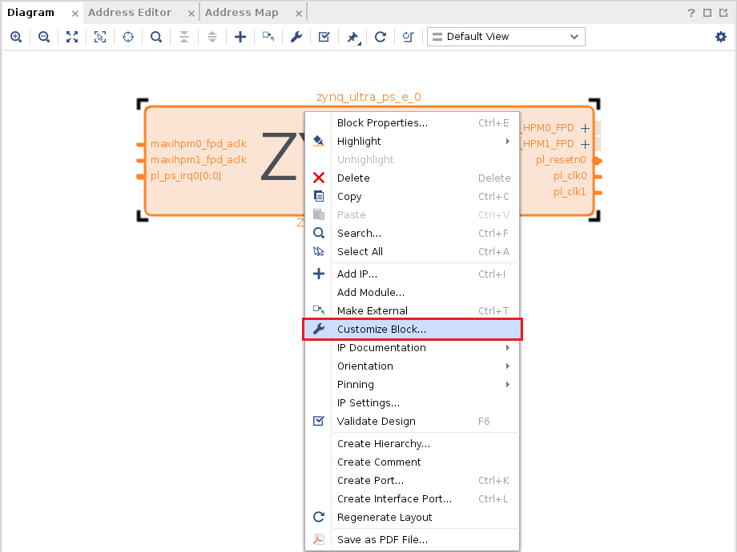

1. In the Page Navigator, select the *PS-PL Configuration* (a)
1. In the `PS-PL Configuration` pane (b), expand 
`PS-PL Interfaces > Master Interfaces` (c)
1. Uncheck `AXI HPM0 FPD` and `AXI HPM1 FPD` then check `AXI HPM0 LPD` and
make sure that the `AXI HPM0 LPD Data Width` is set to 32 (d)
1. In the `PS-PL Configuration` pane expand
`PS-PL Interfaces > Slave Interfaces` (e)
1. Check `AXI HP0 FPD` and make sure that the `AXI HP0 FPD Data Width`
is set to 128 (f)
1. Click OK (g)

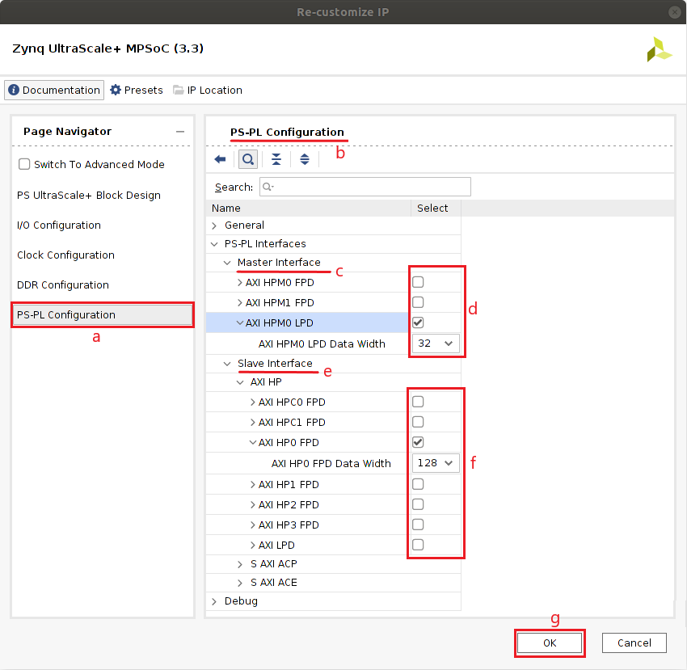

### Add Direct Memory Access (DMA)

1. Click the `+` button to add a new IP (a)
1. Search for **AXI Direct Memory Access** (b)

   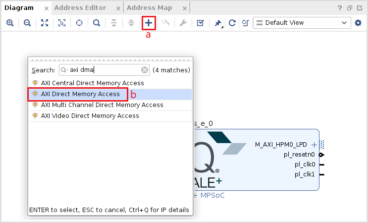

1. Double click on the **AXI Direct Memory Access** to configure the block
1. Uncheck *Enable Scatter Gather Engine* (c)
1. Set the Width of Buffer Length Register to 26 (d)
1. Click OK (e)

   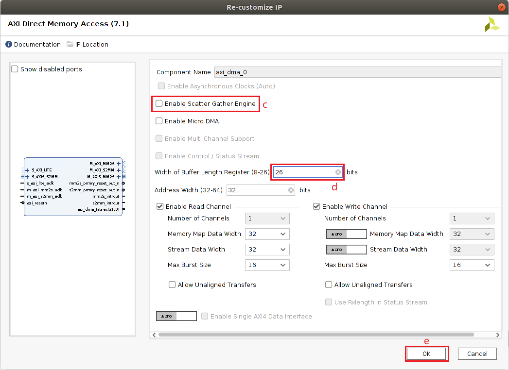

1. Modify the name of the DMA by selecting the block and then on the
*Block Properties* window, on the left hand side, change the name to `axi_dma`
   
   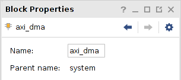

1. Click *Run Connection Automation* (f)
1. Check *All Automation (2 out of 2 selected)* (g) and then click *OK* (h)
   
   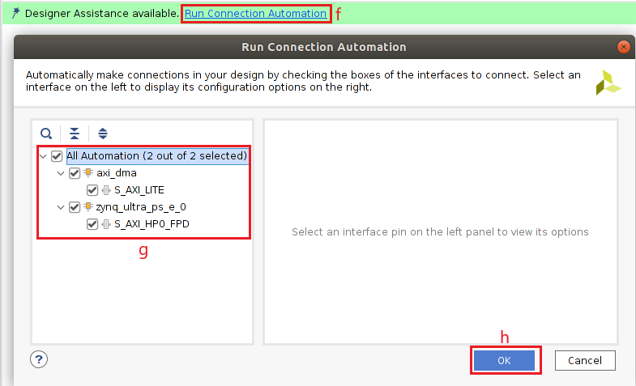

1. Click *Run Connection Automation* again
1. Check *All Automation (1 out of 1 selected)* (i) and then click *OK* (j)
   
   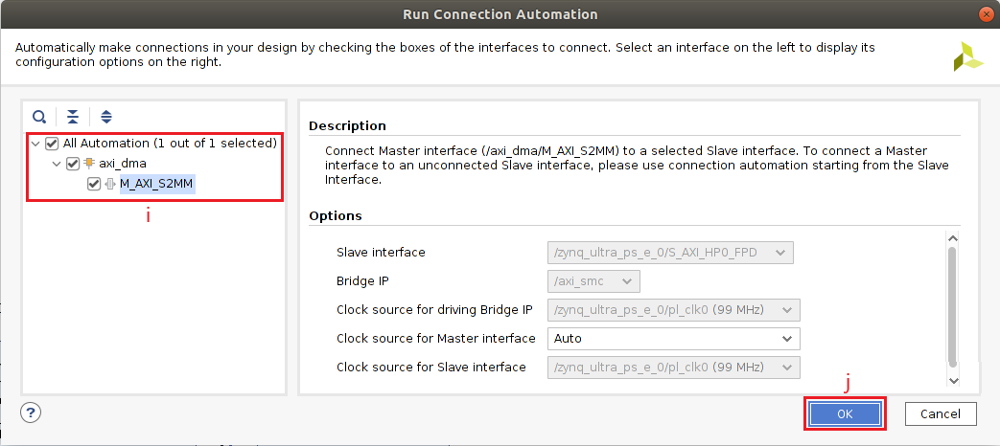

The result is shown below

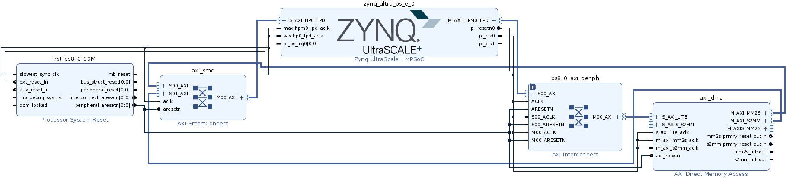

For a comprehensive tutorial about the DMA block read this
[blog](https://discuss.pynq.io/t/tutorial-pynq-dma-part-1-hardware-design/3133).

### Add Interrupt Controller

As you may have noticed, the **AXI Direct Memory Access** has two interrupts,
mm2s_introut and s2mm_introut. We need to connect these to the PS.
`pynq` support multiple interrupts via an **AXI Interrupt Controller**.
For more information check out the [documentation](https://pynq.readthedocs.io/en/latest/pynq_libraries/interrupt.html?#interrupt-controller)

1. Click the *+* button
1. Search for **AXI Interrupt Controller**

   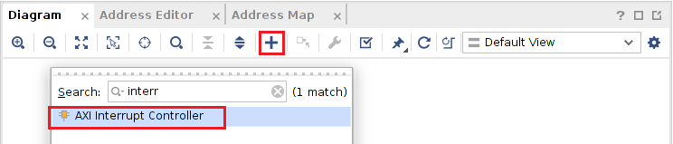

1. Rename the block to `axi_intc`
1. Double click on the **AXI Interrupt Controller** module to configure it
1. Change Interrupt Output Connection to Single and click *OK*

   

1. Click *Run Connection Automation*
1. Check *All Automation (1 out of 1 selected)* and then click OK

   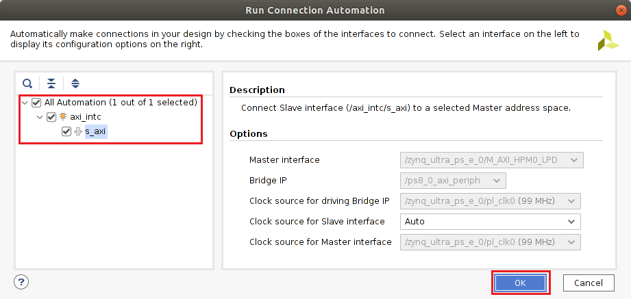

1. Wire the `axi_intc/irq` pin to the `zynq_ultra_ps_e_0/pl_ps_irq0` pin
1. Add a `Concat` IP. By default this IP has to inputs and one output, this is
exactly what we need
1. Wire the `axi_dma/mm2s_introut` pin to any of the `xlconcat_0` input pins,
do the same for the `axi_dma/s2mm_introut` pin
1. Wire the `xlconcat_0/dout` pin to the `axi_intc/intr` pin

The result is shown below

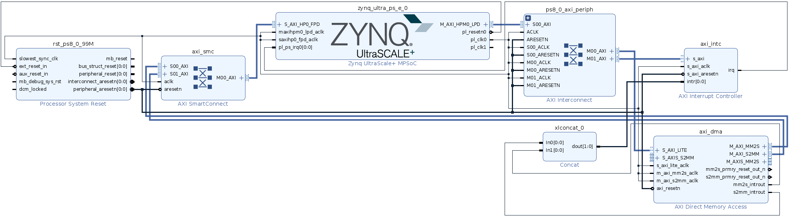

## Make the Overlay Composable

With the basic infrastructure in place, it is high time we made this overlay
composable.

There are two key characteristics of a composable overlay **1)** it uses
at least one AXI4-Stream Switch -- configured to use control register routing--
and **2)** wrap the composable logic into a hierarchy.
The instructions below describe the steps to accomplish this.

### Add the AXI4-Stream Switch

1. Click the *+* button to add a new IP
1. Search for the **AXI4-Stream Switch**

   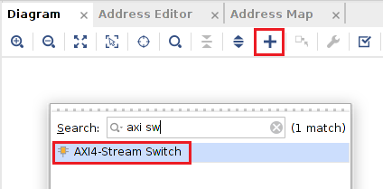

1. Double click on the **AXI4-Stream Switch** module to configure it
1. Set the *Number of subordinate interfaces* to 6 (a)
1. Set the *Number of manager interfaces* to 6 (b)
1. Set *Use control register routing* to Yes (c)
1. In the *Signal Properties* section, enable *TREADY* and *TLAST*,
disable *TSTRB* and *TKEEP*, set *TDATA Width (bytes)* to 4 (d)
1. Click *OK* (e)

   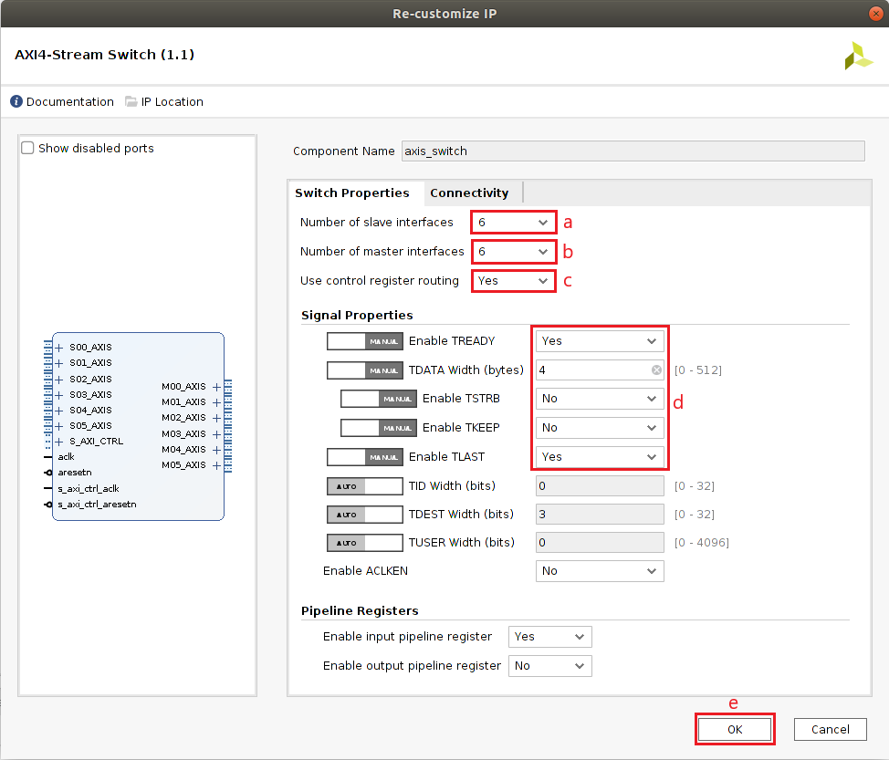

1. Connect the `axi_dma/M_AXIS_MM2S` interface to the 
`axis_switch_0/S03_AXIS` interface
1. Connect the `axis_switch_0/M01_AXIS` interface to the  interface
`axi_dma/S_AXIS_S2MM`

   Note that the connections to the **AXI4-Stream Switch** are arbitrary,
   you can change these connections if you wish

1. Click *Run Connection Automation*
1. Check *All Automation (1 out of 1 selected)* and then click OK

   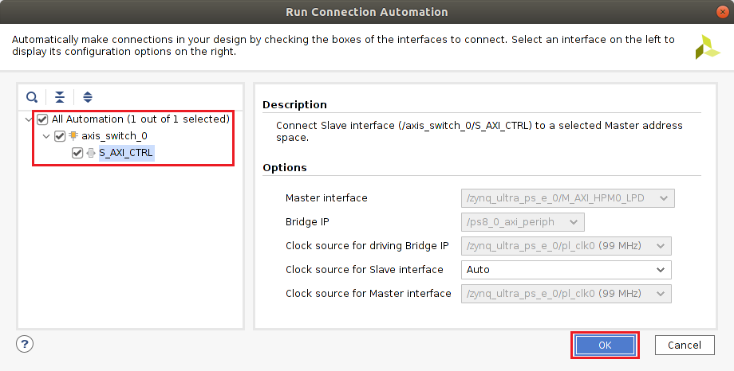

The result is shown below

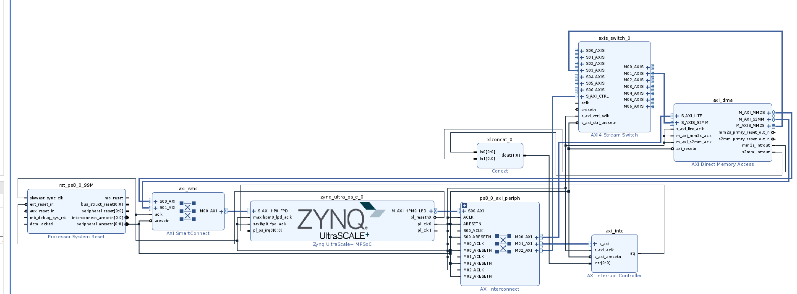

### Create Composable Hierarchy

1. Right click on the **AXI4-Stream Switch** and then click on
*Create a Hierarchy...*

   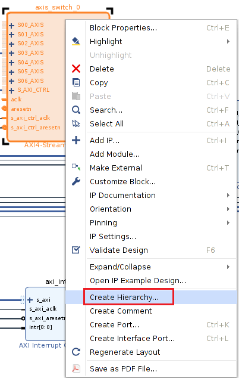

1. Use *Cell name:* **filter**

   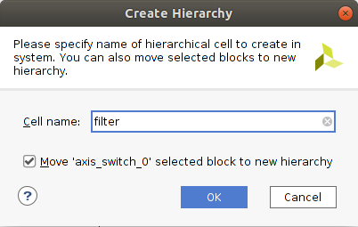

The result is shown below

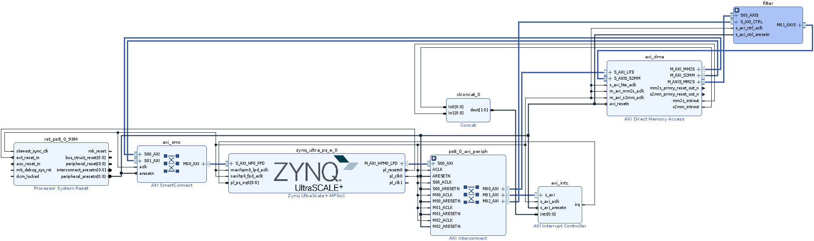

Double click on the hierarchy to inspect it.

### Add Filters

So far, we have added the **AXI4-Stream Switch** and created the hierarchy.
Let's now add the IP blocks that will be part of our composable scope.
For this, we will use the standard Xilinx IP to implement
[Finite Impulse Response (FIR) filters](https://en.wikipedia.org/wiki/Finite_impulse_response).
If you are not familiar with FIR filters, all you need to know is that FIR
filters are a way to remove unwanted components from a signal. In this
tutorial we are going to instantiate four FIR filters: 1) low pass filter,
2) high pass filter, 3) pass band filter and 4) stop band filters.
The configuration for these filters can be found in the
[appendix section](#fir-filter-configuration).

To make this step easier we will use TCL commands. To execute these commands
use the TCL console.

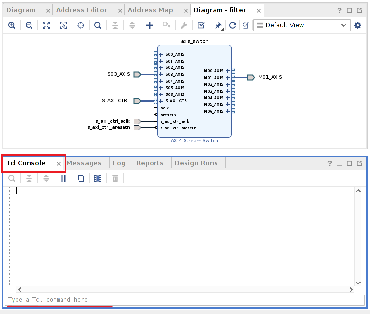

Copy and paste the following TCL commands on the TCL console.

```tcl
set_property name axis_switch [get_bd_cells filter/axis_switch_0]
set filter_names "fir_lowpass fir_highpass fir_bandpass fir_stopband"
foreach fir ${filter_names} {
  set obj [create_bd_cell -type ip -vlnv xilinx.com:ip:fir_compiler:7.2 "filter/${fir}"]
  set_property -dict [ list \
   CONFIG.Coefficient_Fractional_Bits {0} \
   CONFIG.Coefficient_Reload {false} \
   CONFIG.Coefficient_Sets {1} \
   CONFIG.Coefficient_Sign {Signed} \
   CONFIG.Coefficient_Structure {Inferred} \
   CONFIG.Coefficient_Width {16} \
   CONFIG.DATA_Has_TLAST {Packet_Framing} \
   CONFIG.Data_Sign {Signed} \
   CONFIG.Data_Width {32} \
   CONFIG.M_DATA_Has_TREADY {true} \
   CONFIG.Output_Rounding_Mode {Truncate_LSBs} \
   CONFIG.Output_Width {32} \
   CONFIG.Quantization {Integer_Coefficients} \
 ] $obj
}
set_property -dict [ list CONFIG.CoefficientVector {-133, -375, -356, -559, -643, -731, -731, -650, -458, -153, 263, 772, 1348, 1949, 2532, 3048, 3453, 3712, 3800, 3712, 3453, 3048, 2532, 1949, 1348, 772, 263, -153, -458, -650, -731, -731, -643, -559, -356, -375, -133}] [get_bd_cells filter/fir_lowpass]
set_property -dict [ list CONFIG.CoefficientVector {1136, -1197, -580, -33, 438, 658, 461, -116, -762, -1015, -565, 480, 1532, 1774, 604, -1953, -5154, -7805, 23932, -7805, -5154, -1953, 604, 1774, 1532, 480, -565, -1015, -762, -116, 461, 658, 438, -33, -580, -1197, 1136}] [get_bd_cells filter/fir_highpass]
set_property -dict [ list CONFIG.CoefficientVector {195, 42, -82, -129, -41, -6, -269, -705, -710, 234, 1758, 2526, 1313, -1585, -4106, -3949, -708, 3427, 5298, 3427, -708, -3949, -4106, -1585, 1313, 2526, 1758, 234, -710, -705, -269, -6, -41, -129, -82, 42, 195}] [get_bd_cells filter/fir_bandpass]
set_property -dict [ list CONFIG.CoefficientVector {-1705, 2484, 232, -657, -484, 337, 1239, 1622, 1243, 449, 58, 737, 2347, 3809, 3706, 1322, -2668, -6410, 24833, -6410, -2668, 1322, 3706, 3809, 2347, 737, 58, 449, 1243, 1622, 1239, 337, -484, -657, 232, 2484, -1705}] [get_bd_cells filter/fir_stopband]

set axis_data_fifo [ create_bd_cell -type ip -vlnv xilinx.com:ip:axis_data_fifo:2.0 filter/axis_data_fifo ]
set_property -dict [ list CONFIG.HAS_TKEEP {0} CONFIG.HAS_TLAST {1} CONFIG.HAS_TSTRB {0} CONFIG.TDATA_NUM_BYTES {4} ] $axis_data_fifo

connect_bd_net [get_bd_pins filter/s_axi_ctrl_aclk] [get_bd_pins filter/axis_data_fifo/s_axis_aclk] [get_bd_pins filter/fir_bandpass/aclk] [get_bd_pins filter/fir_highpass/aclk] [get_bd_pins filter/fir_lowpass/aclk] [get_bd_pins filter/fir_stopband/aclk] [get_bd_pins filter/axis_switch/aclk]

connect_bd_net [get_bd_pins filter/s_axi_ctrl_aresetn] [get_bd_pins filter/axis_data_fifo/s_axis_aresetn]  [get_bd_pins filter/axis_switch/aresetn]
```

Four FIR compilers and one FIFO were added to the hierarchy, note that the
manager and subordinates of these blocks are not connected. You can connect
the managers and subordinates of these IP to any manager or subordinate of the
**AXI4-Stream Switch**, for instance as shown below.

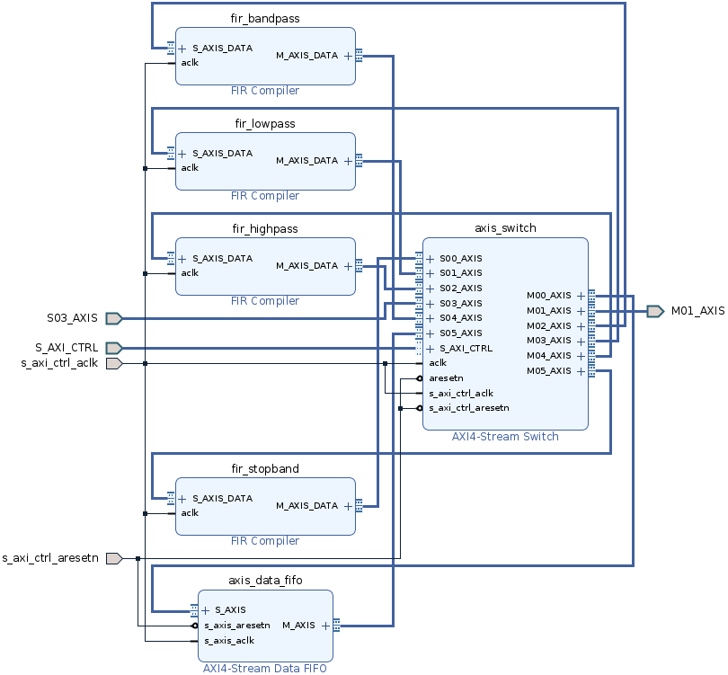

## Generate Bitstream

Now that our composable overlay is ready, let's generate the bitstream.

1. Save Block Design by clicking on *File > Save Block Design* or *CTRL + S*
1. Validate the Design by clicking on *Tools > Validate Design* or F6 or click
this button 
1. Click *OK* on the pop up

   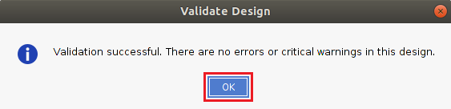

1. Generate the HDL wrapper, on the *Sources* window right clock on
**system** and then select *Create HDL Wrapper...*

   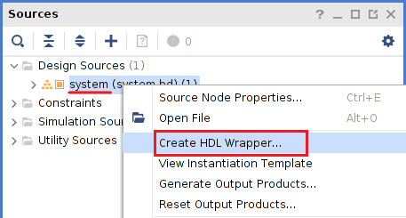

1. In the Create HDL Wrapper window select
*Let Vivado manage wrapper and auto-update* (a) then click *OK* (b)
   
   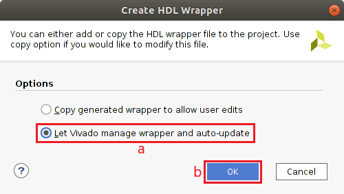

1. In the PROJECT MANAGER pane click *Generate Bitstream*
   
   

1. Click Yes to launch synthesis and implementation
   
   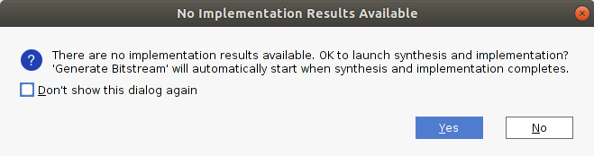

1. Select *Launch runs on local host* (a) then click *OK* (b)

   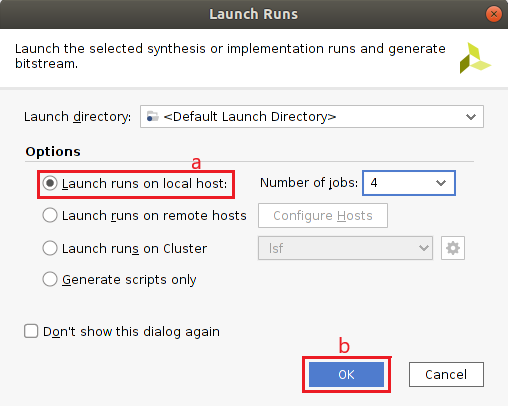

## Default Path

In a composable overlay, a default path specifies the nodes that are source
and sink in a design, this is consumer and producer. These default paths are
annotated with the keyword ``[default]`` in the ``c_dict``. In this tutorial
the DMA connections define our default path. We will save information in a
file with the same basename as the overlay plus `_paths` in this case 
`fir_paths.json`. This way the AXI4-Stream Switch gets automatically configured
at the initialization.

```python
{
    "filter": {
        "ps": {
            "si": {
                        "port": 3,
                        "Description": "Stream In"
                },
            "mi": {
                        "port": 1,
                        "Description": "Stream Out"
            }
        }
    }
}
```

## Get Composable overlay files

Copy the overlay files, both `*.bit` and `*.hwh` from the project and then move
them to the Kria KV260 Vision AI Starter Kit, along with the default path file.

After the bitstream is generated, run the following commands in the TCL
console to copy the overlay files to root directory.

```
set prj_path [get_property DIRECTORY [current_project]]
exec cp ${prj_path}/composable_filter.runs/impl_1/system_wrapper.bit fir.bit
exec cp ${prj_path}/composable_filter.gen/sources_1/bd/system/hw_handoff/system.hwh fir.hwh
```

## Get composable overlay on the board

Finally, get the composable overlay files onto the board. You need to copy

* fir.bit
* fir.hwh
* fir_paths.json
* tutorial.ipynb

These files can be found [here](https://github.com/Xilinx/PYNQ_Composable_Pipeline/tree/main/tutorial)

This step assumes that you have PYNQ up and running on the Kria KV260 Vision 
AI Starter Kit. if this is not the case,
[follow the these instructions](https://github.com/Xilinx/Kria-PYNQ#installation).

You can use [scp](https://man7.org/linux/man-pages/man1/scp.1.html) or 
[WinSCP](https://winscp.net/eng/download.php) to copy the files. However,
the most convenient way is to directly
[drag and drop them from Jupyter Lab](https://jupyterlab.readthedocs.io/en/stable/user/files.html#uploading-and-downloading)

## Conclusion

This tutorial shows how to create a composable overlay from scratch using
standard IP from the Vivado catalog. The composable overlay methodology
it is not much different from the traditional overlay methodology.
To create a composable overlay, you only need an AXI4-Stream Switch and
a hierarchy to wrap the composable overlay. What is more, the capabilities of a composable overlay can be highly enhanced
with [DFX](https://www.xilinx.com/content/xilinx/en/products/design-tools/vivado/high-level-design.html#dfx),
however the DFX technology is outside the scope of this tutorial.

In the second part of this tutorial, [Jupyter Notebook](tutorial.ipynb).
We will explore our composable overlay directly from the KV260, and you will
learn how to use it. You will notice that the Python API abstracts away the
intricacies of the underlying hardware while providing maximum flexibility.

## Appendix

### FIR Compiler Configuration

These filters were generated with [t-filter.engineerjs.com](http://t-filter.engineerjs.com/)

The Sampling Frequency (fs) is 44100 Hz for the filters and all the FIR filters
are implemented using 37 taps.

#### Low Pass Filter

| From    | To        | Gain | ripple/attenuation |
|---------|-----------|------|--------------------|
|    0 Hz |  2,000 Hz |    1 |               5 dB |
| 3,500Hz | 22,050 Hz |    0 |             -40 dB |

#### High Pass Filter

| From    | To        | Gain | ripple/attenuation |
|---------|-----------|------|--------------------|
|    0 Hz |  5,000 Hz |    0 |             -40 dB |
| 6,500Hz | 22,050 Hz |    1 |               3 dB |


#### Band Pass Filter

| From    | To        | Gain | ripple/attenuation |
|---------|-----------|------|--------------------|
|    0 Hz |  3,000 Hz |    0 |             -40 dB |
| 5,000Hz |  7,000 Hz |    1 |               3 dB |
| 9,000Hz | 22,050 Hz |    0 |             -40 dB |

#### Band Stop Filter

| From    | To        | Gain | ripple/attenuation |
|---------|-----------|------|--------------------|
|    0 Hz |  1,000 Hz |    1 |               5 dB |
| 2,400Hz |  5,000 Hz |    0 |             -40 dB |
| 7,300Hz | 22,050 Hz |    1 |               5 dB |
